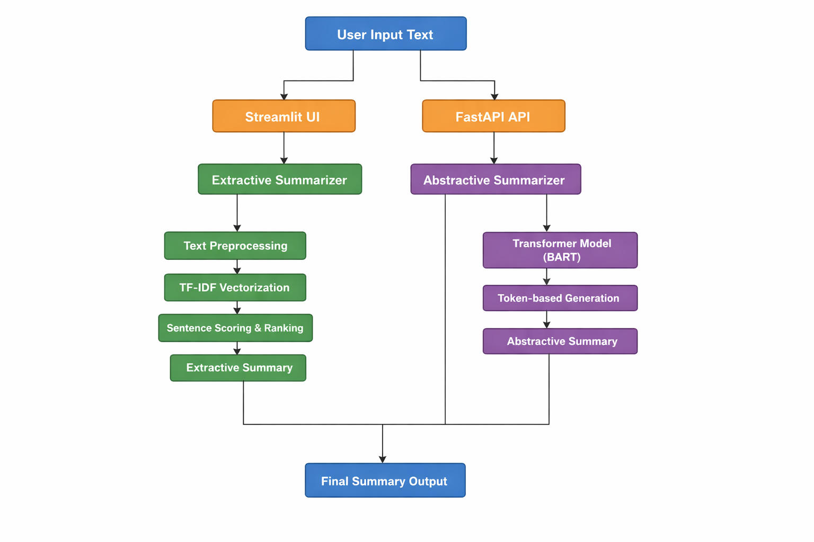

# 📝 Extractive & Abstractive Text Summarization using NLP

An end-to-end **Natural Language Processing (NLP)** project that implements both  
**Extractive** and **Custom Abstractive Text Summarization** with an interactive **Streamlit UI**, **FastAPI backend**, and optional **GPU acceleration**.

---

## 📌 About the Project

This project implements a complete **Text Summarization system** using NLP techniques.  
It supports:

- **Extractive Summarization** using TF-IDF vectorization and sentence ranking
- **Abstractive Summarization** using a Transformer-based model (BART) with custom sentence-length control

The application follows a **modular, production-style architecture** and provides:
- A **Streamlit web interface** for interactive usage
- A **FastAPI backend** for API-based access
- **GPU support** for faster abstractive summarization

This project demonstrates practical NLP engineering, clean code organization, and real-world deployment considerations.

---

## 🧠 Topics Covered

- Natural Language Processing (NLP)
- Text Preprocessing & Tokenization
- Extractive Text Summarization
- TF-IDF Vectorization
- Sentence Scoring & Ranking
- Abstractive Text Summarization
- Transformer Models (BART)
- Custom Summary Length Control
- GPU Acceleration with PyTorch
- Streamlit Web Application
- FastAPI REST API
- Model Evaluation (ROUGE Metrics)
- Logging & Exception Handling
- Modular Python Project Structure
- Git & GitHub Workflow

---

## 📁 Project Structure

<p align="center">
  
</p>

---

## 🔄 Project Workflow

<p align="center">
  
</p>

---

## 🚀 Steps to Run the Project (Complete Guide)

Follow the steps below to run the **Extractive & Abstractive Text Summarization** project locally.

---

### 🔹 Step 1: Clone the Repository

```bash
git clone https://github.com/HimanshuSahu04/Extractive-Text-Summarization-using-NLP.git
cd Extractive-Text-Summarization-using-NLP
```

### 2️⃣ Create & Activate Virtual Environment (Recommended)
**Using Conda**
```bash
conda create -n summarizer_gpu python=3.9 -y
conda activate summarizer_gpu
```
**OR using Python venv**
```bash
python -m venv venv
```

**Activate the environment**

* Windows:
```bash
venv\Scripts\activate
```

* Linux / macOS:

source venv/bin/activate

### 3️⃣ Install Required Dependencies
```bash
pip install -r requirements.txt
```

If 'requirements.txt' is not available:
```bash
pip install torch transformers nltk scikit-learn streamlit fastapi uvicorn sentencepiece safetensors requests pyyaml
```

### 4️⃣ Download NLTK Resources (One-Time Setup)
```bash
python -c "import nltk; nltk.download('punkt')"
```

### 5️⃣ Run the Streamlit Web Application
```bash
streamlit run streamlit_app.py
```

📌 Open your browser and go to:
```
http://localhost:8501
```


### 6️⃣ (Optional) Run the FastAPI Backend
```bash
uvicorn api.app:app --reload
```

📌 API will be available at:
```
http://127.0.0.1:8000
```

Swagger UI:
```
http://127.0.0.1:8000/docs
```

### 🖥️ GPU Support (Optional)

If an NVIDIA GPU is available, the project automatically uses it for abstractive summarization.

Verify GPU support:
```bash
python -c "import torch; print(torch.cuda.is_available())"
```

### ✅ Output

* Extractive Summary <br>
Sentence-based summary using TF-IDF and sentence ranking

* Abstractive Summary<br>
Transformer-based summary with controlled length

Results are displayed via:

* Streamlit Web UI
* FastAPI API responses
